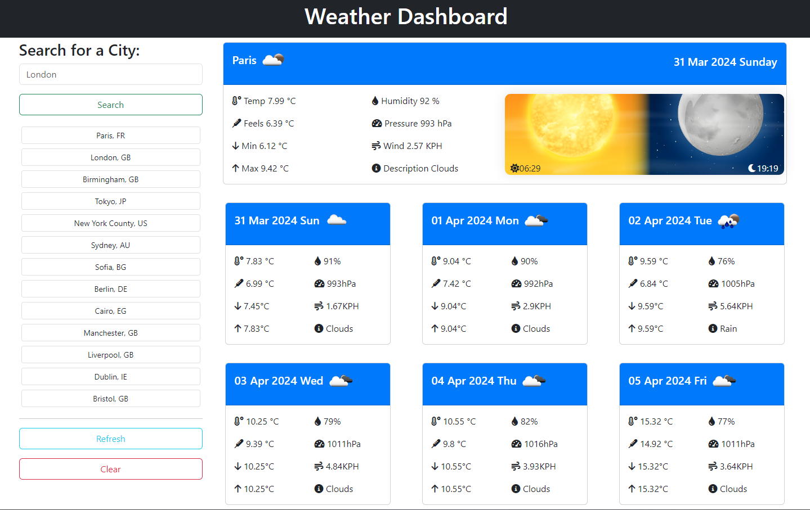

# Weather-Dashboard

    [](./LICENSE)


## Description
Weather Dashboard is a web application that allows users to search for weather information for different cities. It provides users with current weather conditions as well as a five-day forecast.

## Research

| [Link 1](https://developer.mozilla.org/en-US/docs/Web/HTTP/Overview)
| [Link 1](https://openweathermap.org/forecast5)
| [Link 1](https://openweathermap.org/api/geocoding-api)
| [Link 1](https://developer.mozilla.org/en-US/docs/Web/API/Fetch_API)
| [Link 1](https://www.freecodecamp.org/news/javascript-date-time-dayjs)
| [Link 1](http://gregfranko.com/jquery-best-practices/)
| [Link 1](https://w3c.github.io/geolocation-api/#geolocation_interface)
| [Link 1](https://developer.mozilla.org/en-US/docs/Web/API/Geolocation_API)
| [Link 1](https://www.w3schools.com/html/html5_geolocation.asp)
| [Link 1](https://www.w3schools.com/html/tryit.asp?filename=tryhtml5_geolocation) |

## Features

- **Search for Cities:** Users can search for weather information for any city around the world.
- **Today's Forecast:** Displays current weather conditions including temperature, humidity, pressure, wind speed, and description.
- **Five-Day Forecast:** Provides a forecast for the next five days including temperature, humidity, pressure, and wind speed.
- **Search History:** Keeps a history of previously searched cities for easy access.

## Technologies Used

- HTML5
- CSS3 (Bootstrap 5)
- JavaScript (jQuery)
- OpenWeatherMap API
- Geolocation API
- GitHub

## UX preview 


## Website preview



## Installation

### Option 1 - Download

Download the project from GitHub [repository](https://github.com/FilipPaskalev/Weather-Dashboard.git) on your local machine.

1. Open GitHub repository. [(link to repository)](https://github.com/FilipPaskalev/Weather-Dashboard.git)

2. Select ```Code``` from top navigation section. (reference on the image below) 👇

    

3. Select ```<> Code``` dropdown button from sub section. (reference on the image below) 👇

    

4. Select ```Download ZIP``` from dropdown menu to download project in .zip format. (reference on the image below) 👇

    

5.  Unzip the project. 

    > [!TIP]
    > You can use 7-Zip if you don't have file archiver. 
    >**7-Zip** is **free software** with **open source**. The most of the code is under the **GNU LGPL** license. Some parts of the code are under the BSD 3-clause License. Also there is unRAR license restriction for some parts of the code. Read [7-Zip License](https://www.7-zip.org/license.txt) information. 
    > Download the application from [official website](https://www.7-zip.org/).

6.  Open project with VS Code or other IDE.

### Option 2 - Clone project

1. On GitHub.com, navigate to the main page of the repository. [(link to repository)](https://github.com/FilipPaskalev/Weather-Dashboard.git).

2. Above the list of files, click  Code. (reference on the image below) 👇

    

3. Copy the URL for the repository.
- To clone the repository using HTTPS, under "HTTPS", click <svg version="1.1" fill="#0F66B8" width="16" height="16" viewBox="0 0 16 16" aria-label="Copy to clipboard" role="img"><path d="M3.626 3.533a.249.249 0 0 0-.126.217v9.5c0 .138.112.25.25.25h8.5a.25.25 0 0 0 .25-.25v-9.5a.249.249 0 0 0-.126-.217.75.75 0 0 1 .752-1.298c.541.313.874.89.874 1.515v9.5A1.75 1.75 0 0 1 12.25 15h-8.5A1.75 1.75 0 0 1 2 13.25v-9.5c0-.625.333-1.202.874-1.515a.75.75 0 0 1 .752 1.298ZM5.75 1h4.5a.75.75 0 0 1 .75.75v3a.75.75 0 0 1-.75.75h-4.5A.75.75 0 0 1 5 4.75v-3A.75.75 0 0 1 5.75 1Zm.75 3h3V2.5h-3Z"></path></svg>
- To clone the repository using an SSH key, including a certificate issued by your organization's SSH certificate authority, click SSH, then click <svg version="1.1" fill="#0F66B8" width="16" height="16" viewBox="0 0 16 16" aria-label="Copy to clipboard" role="img"><path d="M3.626 3.533a.249.249 0 0 0-.126.217v9.5c0 .138.112.25.25.25h8.5a.25.25 0 0 0 .25-.25v-9.5a.249.249 0 0 0-.126-.217.75.75 0 0 1 .752-1.298c.541.313.874.89.874 1.515v9.5A1.75 1.75 0 0 1 12.25 15h-8.5A1.75 1.75 0 0 1 2 13.25v-9.5c0-.625.333-1.202.874-1.515a.75.75 0 0 1 .752 1.298ZM5.75 1h4.5a.75.75 0 0 1 .75.75v3a.75.75 0 0 1-.75.75h-4.5A.75.75 0 0 1 5 4.75v-3A.75.75 0 0 1 5.75 1Zm.75 3h3V2.5h-3Z"></path></svg>
- To clone a repository using GitHub CLI, click GitHub CLI, then click <svg version="1.1" fill="#0F66B8" width="16" height="16" viewBox="0 0 16 16" aria-label="Copy to clipboard" role="img"><path d="M0 6.75C0 5.784.784 5 1.75 5h1.5a.75.75 0 0 1 0 1.5h-1.5a.25.25 0 0 0-.25.25v7.5c0 .138.112.25.25.25h7.5a.25.25 0 0 0 .25-.25v-1.5a.75.75 0 0 1 1.5 0v1.5A1.75 1.75 0 0 1 9.25 16h-7.5A1.75 1.75 0 0 1 0 14.25Z"></path><path d="M5 1.75C5 .784 5.784 0 6.75 0h7.5C15.216 0 16 .784 16 1.75v7.5A1.75 1.75 0 0 1 14.25 11h-7.5A1.75 1.75 0 0 1 5 9.25Zm1.75-.25a.25.25 0 0 0-.25.25v7.5c0 .138.112.25.25.25h7.5a.25.25 0 0 0 .25-.25v-7.5a.25.25 0 0 0-.25-.25Z"></path></svg> (reference on the image below) 👇

    

1. Open Git Bash.

2. Change the current working directory to the location where you want the cloned directory.

3. Type ```git clone```, and then paste the URL you copied earlier.

    ```
    git clone https://github.com/FilipPaskalev/Weather-Dashboard.git
    ```

4. Press Enter to create your local clone.

    ```
    $ git clone **https://github.com/DonielM/team-reactless-instagit.git**
    > Cloning into `Spoon-Knife`...
    > remote: Counting objects: 10, done.
    > remote: Compressing objects: 100% (8/8), done.
    > remove: Total 10 (delta 1), reused 10 (delta 1)
    > Unpacking objects: 100% (10/10), done.
    ```

## Getting Started

To get started with the Weather Dashboard, simply clone this repository to your local machine and open the `index.html` file in a web browser.

```bash
git clone https://github.com/your-username/weather-dashboard.git
```

## License

MIT License

Copyright (c) 2024 Phil

Permission is hereby granted, free of charge, to any person obtaining a copy
of this software and associated documentation files (the "Software"), to deal
in the Software without restriction, including without limitation the rights
to use, copy, modify, merge, publish, distribute, sublicense, and/or sell
copies of the Software, and to permit persons to whom the Software is
furnished to do so, subject to the following conditions:

The above copyright notice and this permission notice shall be included in all
copies or substantial portions of the Software.

THE SOFTWARE IS PROVIDED "AS IS", WITHOUT WARRANTY OF ANY KIND, EXPRESS OR
IMPLIED, INCLUDING BUT NOT LIMITED TO THE WARRANTIES OF MERCHANTABILITY,
FITNESS FOR A PARTICULAR PURPOSE AND NONINFRINGEMENT. IN NO EVENT SHALL THE
AUTHORS OR COPYRIGHT HOLDERS BE LIABLE FOR ANY CLAIM, DAMAGES OR OTHER
LIABILITY, WHETHER IN AN ACTION OF CONTRACT, TORT OR OTHERWISE, ARISING FROM,
OUT OF OR IN CONNECTION WITH THE SOFTWARE OR THE USE OR OTHER DEALINGS IN THE
SOFTWARE.


